1. python -m venv [가상환경이름]
   - python -m venv venv
   - **가상환경 만들기**

<br>

---
2. source [가상환경이름]/Scripts/activate
   - source venv/Scripts/activate
   - . venv/Scripts/activate
   - `.`을 사용할 경우 현재 폴더 내에서 실행한다는 의미
   - 만약 `cd venv`, 즉 venv 안에서 실행할 경우의 코드는
   - . /Scripts/activate
   - 가상환경을 실행하면 `cd`를 사용해서 이동해도 계속 가상환경이 실행됨
   - 가상환경을 실행하는 이유: 프로젝트 기초 전부를 Python/Django와 분리해줌
     - 웹사이트가 변경되어도 개발 중인 것에 영향을 미치지 않는다(독립적임)
   - **가상환경 실행**

<br>

---
3. deactivate
   - 가상환경이 계속 실행 중이기 때문에 아무런 폴더에서 `deactivate`하면 가상환경 종료됨
   - **가상환경 종료**

<br>

---
4. pip list
   - pip: 파이썬으로 작성된 패키지 라이브러리를 관리해주는 시스템
   - 가상환경을 처음 실행한 상태에서 `pip list`를 실행할 경우 아무것도 안나오는게 정상
   - **현재 내 컴퓨터에 설치된 파이썬 패키지 목록을 볼 수 있음**

<br>

---
5. pip install django==[버전]
   - pip install django==3.2.13
   - `==`를 사용하지 않고 `pip install django`하면 django의 최신버전 설치됨
   - **django 설치**

<br>

---
6. pip list
   - django 패키지가 정상적으로 설치되었는지 확인

<br>

---
7. pip freeze > requirements.txt
   - pip freeze: 현재 작업 환경(가상환경)에 설치되어 있는 패키지의 리스트를 모두 출력해줌
   - `requirements.txt` 이름을 바꿔도 상관 없지만 보통 `requirements.txt`로 함
   - **requirements.txt에 설치된 패키지들이 정렬됨**

<br>

---
8. pip install -r requirements.txt
   - `r`: read라는 의미
   - **설정파일 `requirements.txt`에 작성된 내용에 따라 패키지가 일괄 설치됨**

<br>

---
9. django-admin startproject [프로젝트_이름] [프로젝트_시작경로]
   - django-admin startproject pjt .
   - `.`에 따라 `manage.py` 파일의 생성 여부 나뉨
   - `.`: 현재 디렉토리
   - `manage.py` 위치는 상관 없지만 통일해주는 것이 좋음(연습할 땐 둘 다 해보자)
   - 앱을 실행 할 때 `manage.py`가 있는 폴더에서 명령어를 입력해줘야 하기 때문  
   - `django-admin`: `django-manage.py`는 `django-admin.py` 로 프로젝트를 생성할 떄 만들어짐
   - 처음엔 `django-admin.py`를 사용 가능하고 `django-manage.py`는 사용할 수 없다
   - [adim과_manage](https://devlog.jwgo.kr/2018/02/07/what-is-the-diff-btw-manage-django-admin/)
   - [더 자세한 정보](https://docs.djangoproject.com/ko/4.1/ref/django-admin/)
   - **`manage.py` 파일 생성**

<br>

---
10.   python manage.py runserver

      - url에 `localhost:8000` 입력
      - 정상적으로 앞의 내용을 실행했다면 표시된 화면이 나옴
      - `manage.py`: django 명령어를 인식하기 위한 중간역할, django의 명령어 인터페이스(궁금하면 직접 `manage.py` 열어보기)
      - 서버 실행 후 항상 `터미널` 에서 로그 확인
      - 포트 변경: `python manage.py runserver [원하는 포트 번호]`
      - 포트 변경: `python manage.py runserver 8080`
      - 종료: `ctrl + c`
      - **서버 구동**

<br>

---
1.   [프로젝트] 안의 `settings.py` 세팅
  ```python
  LANGUAGE_CODE = 'ko-kr'

  TIME_ZONE = 'Asia/Seoul'
  ```
  - `python manage.py runserver`를 실행했을 경우 한국시간과 한국어로 변경됨

<br>

---
1.  python manage.py startapp [생성할_app_이름]
   - python manage.py startapp articles
   - **앱 생성**

<br>

---
13. 프로젝트 settings.py 설정


  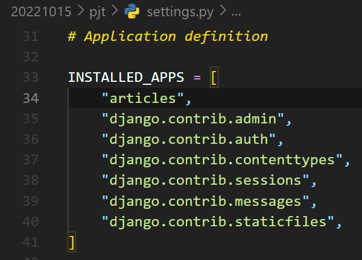
  - `,` 꼭 붙이기
  - **앱 등록**

<br>

---
1.  프로젝트 urls.py
   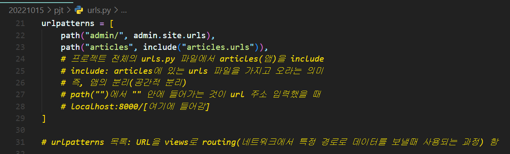
    ```python
    from django.contrib import admin
    from django.urls import path, include

    urlpatterns = [
        path("admin/", admin.site.urls),
        path("articles", include(articles.urls)),
    ]
    ```
    - include를 활용: 공간적 분리

<br>

---
1.  순서
  - 1번 urls.py(url 등록)
  - 2번 views.py(함수 생성)
  - 3번 templates(template 생성)

<br>

---
16. 생성한 앱 urls.py 생성(등록)
    - urlpatterns 추가
    
    - `views.index`가 [동그라미 1번]으로 가고, 이것을 index라는 이름으로 부름
    - `""` [동그라미 1번] 주소로 요청하면 views에 있는 index함수로 응답
    - url 대신 이름을 index로 지정
    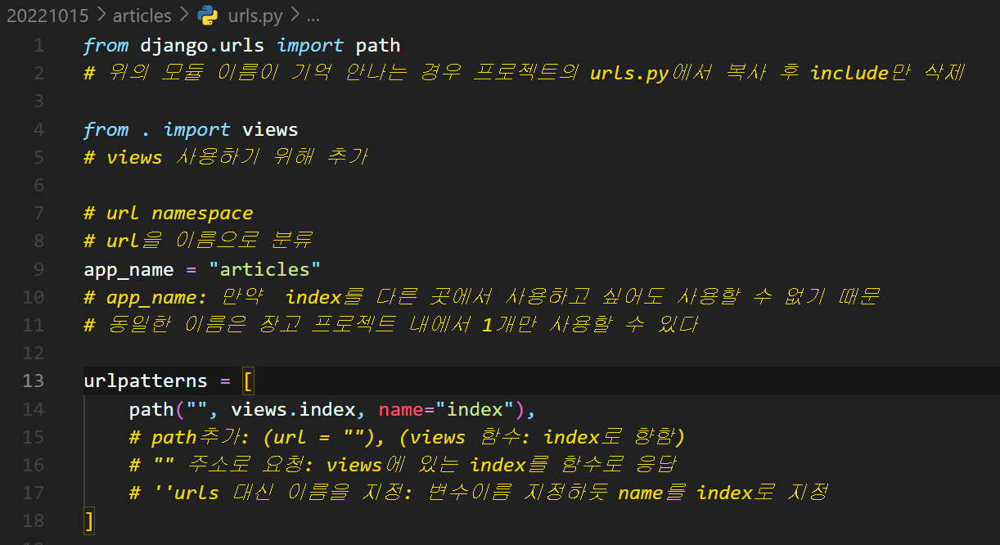
    - app_name: url namespace(url을 이름으로 분류하는 기능, url을 앱별로 분류하는 기능)
    - app_name이 없으면: 다른 앱에서 `index`라는 이름을 사용하지 못함(동일한 이름은 장고 프로젝트에서 1개만 사용할 수 있기 때문)
    - 예를 들면
      ```python
      path('', views.index, name='index')
      path('', views.index, name='index2')
      path('', views.index, name='index3')
      ```

<br>

---
1.   생성한 앱 view.py 함수 정의
  
    ```python
    from django.shortcuts import render

    def index(request):
        return render(request, "articles/index.html")
    ```

<br>

---
1.  Template 생성
    - 20221015(전체 폴더) => articles(앱) => templates(폴더 생성) => articles(폴더 생성) => index.html(파일 생성)
    - `python manage.py runserver` 실행
    - `localhost:8000/articles` 검색 후 실행되는지 확인
    - 실행 안될 경우
      - 프로젝트 폴더, 앱 폴더에서 `""` 혹은 오타 살펴보기

<br>

---
19. 점검  
    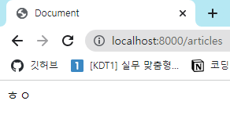
    - URL 요청
    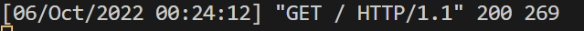
    - 서버로 요청
    
    - 생성한 앱 폴더의 urls.py안의
    - urlpatterns의 목록 안에서
    - views.py에 있는 index함수 실행
    
    - 생성한 앱 폴더의 views.py안의
    - html 파일을 불러옴

<br>

---
# CRUD
20. 모델 정의
  - 1번: 클래스 정의
  - 2번: migrations 파일 생성
  - 3번: DB반영(migrate)

<br>

---
21. 요구사항에 따른 모델 작성
   - 예시
   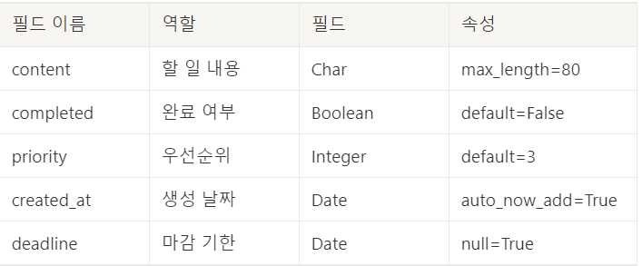

<br>

---
21.  생성한 앱의 models.py 클래스 정의
   ```python
   from django.db import models

   class Article(models.Model):
      content = models.CharField(max_length=80)
      completed = models.BooleanField(default=False)
   ```
   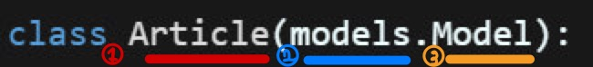
   - Article(1번)은 Models(2번)에 있는 Model(3번)을 상속받아서 모델 만듬
   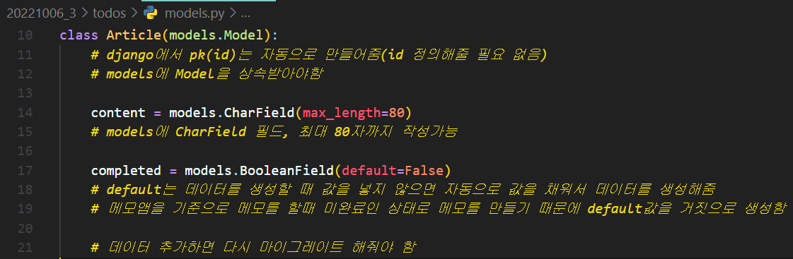

<br>

---
23. makemigrations 파일 생성
   - python manage.py makemigrations
   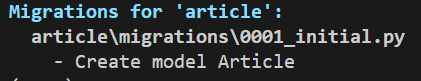
   - 경로를 따라가보면
   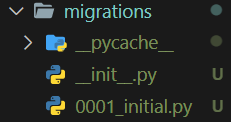
   - `0001_initial.py` 라는 파일이 생성됨
   - db.sqlite3의 새로운 테이블을 만들기 위한 설계도
   - `migrate` 하기 전까지 아무런 내용 없음

<br>

---
24. migrate
   - python manage.py migrate
   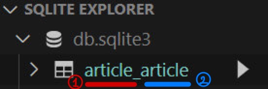
   - 1번: 앱 이름
   - 2번: 모델 이름

<br>

---
25. DB 확인
   - python manage.py showmigrations
   - DB가 제대로 생성되었는지 확인할 수 있다

<br>

---
# CRUD 구현
26. CREATE 생성
   - 기능을 만들때: URL에 mapping 되는 VIEW 함수는 각각 1개씩 필요함(특정 URL의 기능들이 다르기 때문)
   - 기능 추가
     - URL 생성 => VIEW 함수
     - URL에 대응되는 VIEW 함수를 새롭게 생성

<br>

---
27. form 태그
   - 사용자에게 정보를 입력받을 때 form 태그 사용
   - `html` 파일에서 사용
   ```html
   <body>
   <form action="% url 'article:create' %">
   </form>
   </body>
   ```
   - `create`라는 name을 가진 주소를 요청(`create`라는 path를 만들어줘야함)
   - `<form action="% url 'article:create' %">`에서
   - article은 app_name 지정해 둔 것

<br>

---
28. URL(path 만들기)
   - 생성한 앱의 `urls.py`에서 path를 만들어 줌
   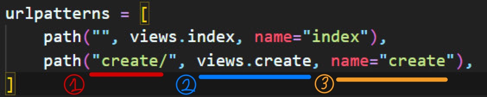
   - 1번: 주소를 create로 요청
   - 2번: views는 create 함수 요청 
   - 3번: name은 create
   - 아직 create 함수를 만들지 않았기 때문에 오류 발생

<br>

---
29. view(함수 작성)
   ```python
   def create(request):
      return render(request, "article/index.html")
   ```

<br>

---
30. form 데이터 생성
   - html 파일 form 에서 views.py에 있는 함수로 데이터를 넘겨줘야 함
   - 함수안에 `content` 생성
   - templates에서 데이터를 get해야 됨
     - `request.GET.get()` 사용
   - html 파일의 input 태그의 name 속성에 값 지정(데이터의 이름을 지정)
   - html 예시
   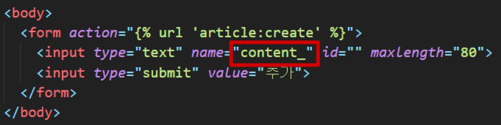
   - views 예시
   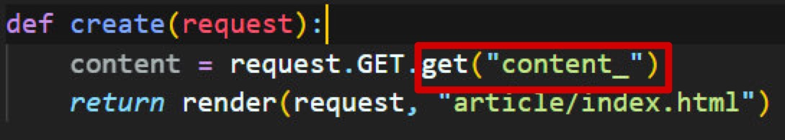

<br>

---
31. 입력 되었는지 확인
   - view.py에 print문 추가
   - html 페이지
   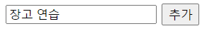
   - views.py
   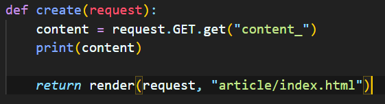
   - terminal
   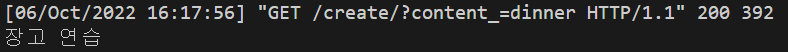
   - 즉, **입력한 문장을 content가 정확히 받았다는 의미**

<br>

---
32. models를 받아옴
   - 생성한 앱의 모델의 데이터 생성
   - model을 import
   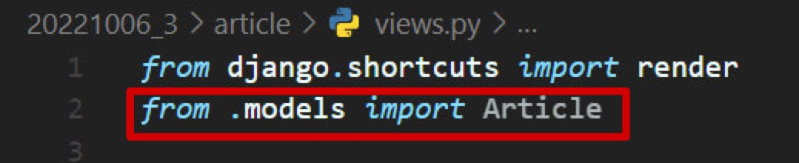
   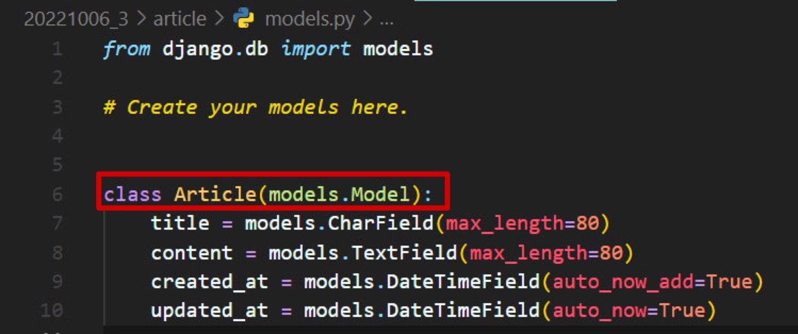

<br>

---
33. DB 저장
   - 생성한 앱의 views.py
   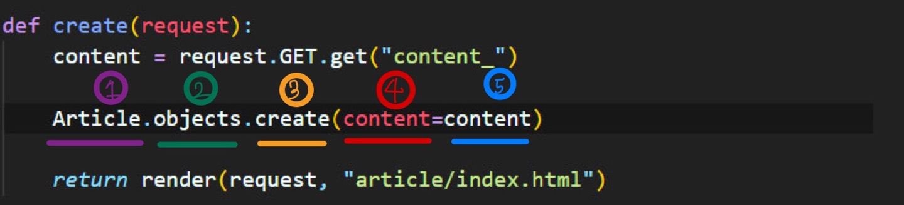
   - 1번: 클래스
   - 2번: objects에
   - 3번: create 메소드 사용
   - 4번: 필드(속성)
   - 5번: 값

<br>

---
34. 저장 확인
   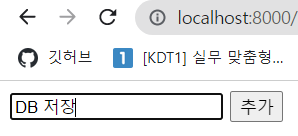
   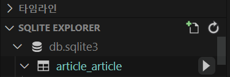
   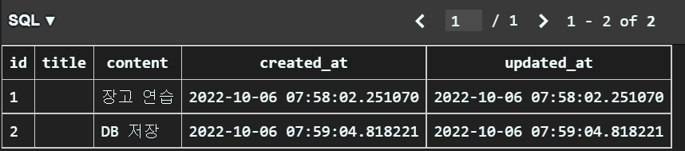
   
<br>

---
35. 데이터 불러오기
   - [클래스].objects.all(): 데이터 불러오는 ORM 코드
   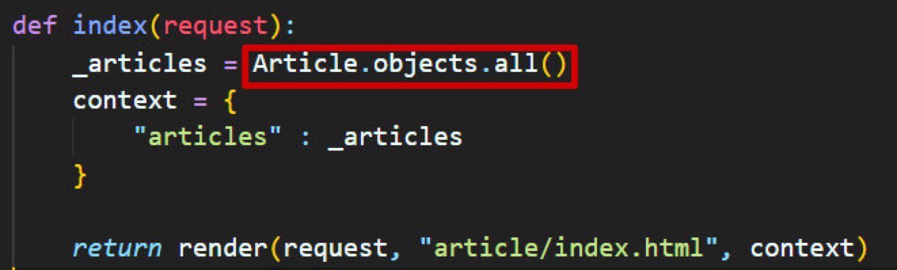
   
<br>

---
36. 변수 할당
   - 불러온 데이터를 변수에 할당
   - articles라는 변수에 할당
   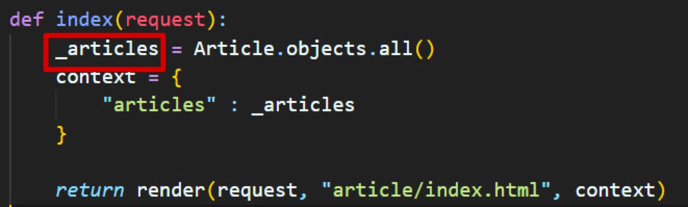
   
<br>

---
37. 변수 출력
   - 딕셔너리 만든 후 변수 출력
   - 딕셔너리(context)
   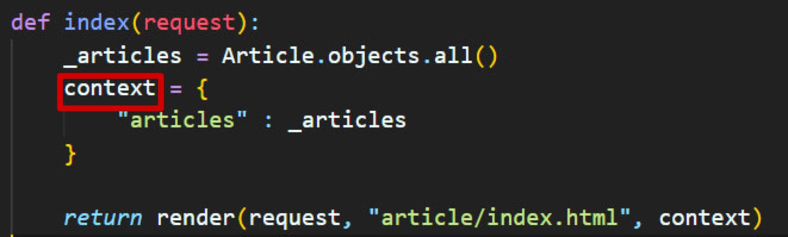
   
<br>

---
38. 인자 넘기기
   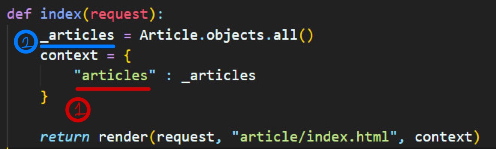
   - 함수에 인자를 넘김
   - templates 변수에서 2번을 출력하기 위해 1번을 넘겨줌
   - render라는 함수에 context 인자 넘김(templates 파일에서 변수들을 사용하기 위함)

<br>

---