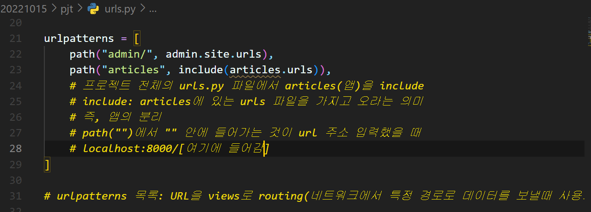
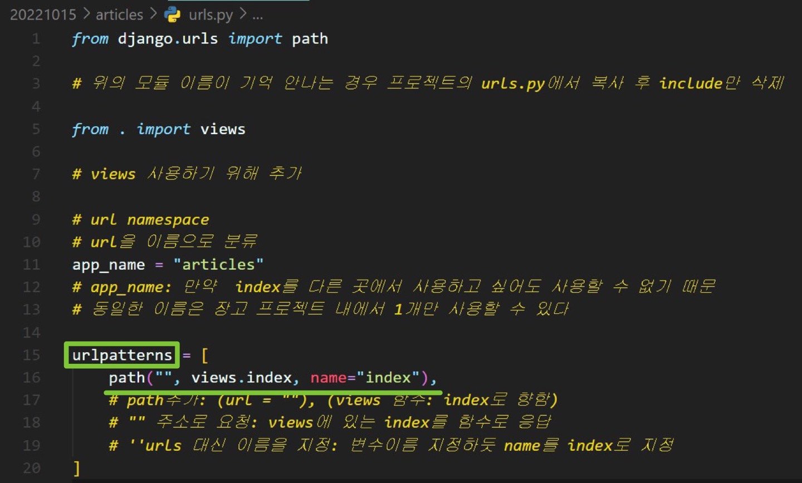
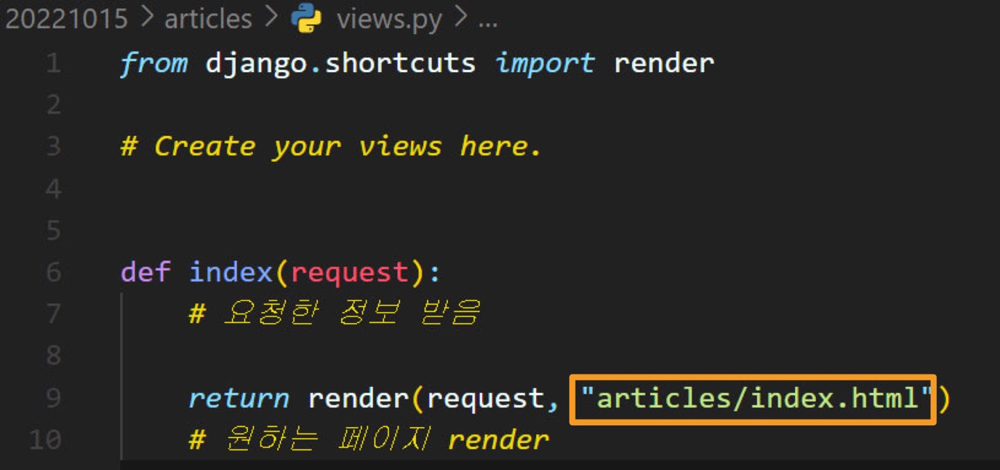

1. python -m venv [가상환경이름]
   - python -m venv venv
   - **가상환경 만들기**

<br>

2. source [가상환경이름]/Scripts/activate
   - source venv/Scripts/activate
   - . venv/Scripts/activate
   - `.`을 사용할 경우 현재 폴더 내에서 실행한다는 의미
   - 만약 `cd venv`, 즉 venv 안에서 실행할 경우의 코드는
   - . /Scripts/activate
   - 가상환경을 실행하면 `cd`를 사용해서 이동해도 계속 가상환경이 실행됨
   - 가상환경을 실행하는 이유: 프로젝트 기초 전부를 Python/Django와 분리해줌
     - 웹사이트가 변경되어도 개발 중인 것에 영향을 미치지 않는다(독립적임)
   - **가상환경 실행**

<br>

3. deactivate
   - 가상환경이 계속 실행 중이기 때문에 아무런 폴더에서 `deactivate`하면 가상환경 종료됨
   - **가상환경 종료**

<br>

4. pip list
   - pip: 파이썬으로 작성된 패키지 라이브러리를 관리해주는 시스템
   - 가상환경을 처음 실행한 상태에서 `pip list`를 실행할 경우 아무것도 안나오는게 정상
   - **현재 내 컴퓨터에 설치된 파이썬 패키지 목록을 볼 수 있음**

<br>

5. pip install django==[버전]
   - pip install django==3.2.13
   - `==`를 사용하지 않고 `pip install django`하면 django의 최신버전 설치됨
   - **django 설치**

<br>

6. pip list
   - django 패키지가 정상적으로 설치되었는지 확인

<br>

7. pip freeze > requirements.txt
   - pip freeze: 현재 작업 환경(가상환경)에 설치되어 있는 패키지의 리스트를 모두 출력해줌
   - `requirements.txt` 이름을 바꿔도 상관 없지만 보통 `requirements.txt`로 함
   - **requirements.txt에 설치된 패키지들이 정렬됨**

<br>

8. pip install -r requirements.txt
   - `r`: read라는 의미
   - **설정파일 `requirements.txt`에 작성된 내용에 따라 패키지가 일괄 설치됨**

<br>

9. django-admin startproject [프로젝트_이름] [프로젝트_시작경로]
   - django-admin startproject pjt .
   - `.`에 따라 `manage.py` 파일의 생성 여부 나뉨
   - `.`: 현재 디렉토리
   - `manage.py` 위치는 상관 없지만 통일해주는 것이 좋음(연습할 땐 둘 다 해보자)
   - 앱을 실행 할 때 `manage.py`가 있는 폴더에서 명령어를 입력해줘야 하기 때문  
   - `django-admin`: `django-manage.py`는 `django-admin.py` 로 프로젝트를 생성할 떄 만들어짐
   - 처음엔 `django-admin.py`를 사용 가능하고 `django-manage.py`는 사용할 수 없다
   - [adim과_manage](https://devlog.jwgo.kr/2018/02/07/what-is-the-diff-btw-manage-django-admin/)
   - [더 자세한 정보](https://docs.djangoproject.com/ko/4.1/ref/django-admin/)
   - **`manage.py` 파일 생성**

<br>

10.   python manage.py runserver

   - url에 `localhost:8000` 입력
   - 정상적으로 앞의 내용을 실행했다면 표시된 화면이 나옴
   - `manage.py`: django 명령어를 인식하기 위한 중간역할, django의 명령어 인터페이스(궁금하면 직접 `manage.py` 열어보기)
   - 서버 실행 후 항상 `터미널` 에서 로그 확인
   - 포트 변경: `python manage.py runserver [원하는 포트 번호]`
   - 포트 변경: `python manage.py runserver 8080`
   - 종료: `ctrl + c`
   - **서버 구동**

<br>

11.  [프로젝트] 안의 `settings.py` 세팅
  ```python
  LANGUAGE_CODE = 'ko-kr'

  TIME_ZONE = 'Asia/Seoul'
  ```
   - `python manage.py runserver`를 실행했을 경우 한국시간과 한국어로 변경됨

<br>

12. python manage.py startapp [생성할_app_이름]
   - python manage.py startapp articles
   - **앱 생성**

<br>

13. 프로젝트 settings.py 설정
   
   - `,` 꼭 붙이기
   - **앱 등록**

<br>

14. 프로젝트 urls.py
   
    ```python
    from django.contrib import admin
    from django.urls import path, include

    urlpatterns = [
        path("admin/", admin.site.urls),
        path("articles", include(articles.urls)),
    ]
    ```

<br>

15. 순서
  1. urls.py(url 등록)
  2. views.py(함수 생성)
  3. templates(template 생성)

<br>

16. 생성한 앱 urls.py 생성(등록)
    - urlpatterns 추가
    
    - `views.index`가 1번으로 가고, 이것을 index라는 이름으로 부름
    

17. 생성한 앱 view.py 함수 정의
  
    ```python
    from django.shortcuts import render

    def index(request):
        return render(request, "articles/index.html")
    ```

18. Template 생성
    - 20221015(전체 폴더) => articles(앱) => templates(폴더 생성) => articles(폴더 생성) => index.html(파일 생성)
    - `python manage.py runserver` 실행
    - `localhost:8000/articles` 검색 후 실행되는지 확인
    - 실행 안될 경우
      - 프로젝트 폴더, 앱 폴더에서 `""` 혹은 오타 살펴보기

19. 점검
    
    - URL 요청
    
    - 서버로 요청
    
    - 생성한 앱 폴더의 urls.py안의
    - urlpatterns의 목록 안에서
    - views.py에 있는 index함수 실행
    
    - 생성한 앱 폴더의 views.py안의
    - html 파일을 불러옴
